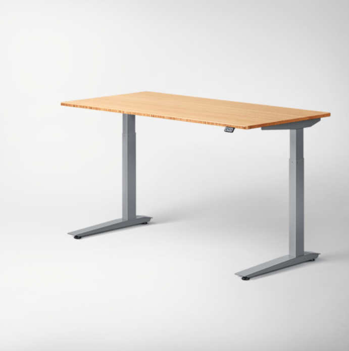

# standroid
An app for controlling a motorized standup desk

I wrote this little program to control my standup desk from different devices
like my laptop or phone, and create predefined programs. After having the desk
for a while the novelty wore off and I wasn't adjusting it much. I thought this
project might motivate me to use it more. Maybe automatic adjustments would do 
the trick. It's also fun to control your desk from a distance, or mess with
your co-worker's desk.

The app runs on a Raspberry Pi, any model will do. It requires you wire up a
4 channel relay board and an ultrasonic distance sensor so you can control them
with the GPIO bus. I used a relay board from Sainsmart, but a bunch of vendors
sell basically the same board. The distance sensor is an HC-SR04 also from
Sainsmart. Easy to find these on Amazon. I've included the schematic.
My desk had nice 5.5mmx2.5mm
power plugs on the supply, switch and motor, and I was able to find plugs that
mate from Digikey. Wiring these up to the relays according to my schematic
allows me to plug this device into the desk without cutting any wires or doing
damage. The circuit also leaves the manual switch functional when the computer
control isn't engaged. My desk is a Jarvis.




This is what the final device looks like (distance sensor not shown). This one
uses an original Pi Model B. The relay board is enclosed in a plastic case.


These are the power plugs mated to the factory connectors of the desk.

## Installing

The server side portion of the app is written in Python, which is usually
installed on the Raspberry Pi. Sorry, it doesn't run on Python3 since I used
the older thread module, but that would be an easy fix. The only
Python module you might need to install is bottle. If you have a clean Raspbian
install, this should get you running:

```bash
sudo apt-get install python-pip
pip install bottle
python standroid.py
```

## Running
Once the server is running, you can checkout the simple web client from
a phone or laptop. Just navigate to http://<pi IP address>/. This client
is very simple with 4 buttons, 2 to adjust a small amount, 2 to adjust a larger
amount.

The server runs a little web service. You can also control from any app or
programming language where you can make web requests. Here are a couple of
examples you can run from the pi itself:

```bash
wget http://localhost/up/5
wget http://localhost/down/4
```

There are just 2 endpoints, one for moving up and the other for down. The number
at the end is how long to engage the motor in seconds.

You could run commands like the ones above from the cron program to make an
schedule of desk movements.

## Be careful!

Controlling the desk comes with a few risks, so be careful. If your desk isn't
able to adjust through the entire range you can get into trouble. Too high can
pull things like monitors off the desk when cables get tight. Too low can
collide with items under the desk like PCs and chairs. Best make sure that the
desk can operate through it's entire range. Be careful not to leave your 
chair under the desk.
